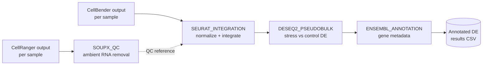

# snRNA-sequencing: sex differences in stress-induced chronic low back pain

Single-nucleus RNA-seq analysis pipeline identifying sex-differentiated gene expression in dorsal horn spinal cord tissue from a rat model of early-life-stress-induced chronic primary low back pain.

Originally a set of exploratory R/Rmd notebooks; refactored here into a reproducible [Nextflow](https://www.nextflow.io/) pipeline with containerized dependencies, so any stage can be re-run deterministically on a laptop, HPC cluster, or cloud executor.

## Pipeline



| Stage | Process | Input | Output |
|---|---|---|---|
| 1 | `SOUPX_QC` | CellRanger `outs/` per sample | SoupX-cleaned Seurat object (`.rds`) |
| 2 | `SEURAT_INTEGRATION` | CellBender-denoised `.h5` per sample + samplesheet metadata (sex, group) | Integrated Seurat object (`sex.combined.rds`) |
| 3 | `DESEQ2_PSEUDOBULK` | Integrated object | Pseudobulk DE results (stress vs. control) |
| 4 | `ENSEMBL_ANNOTATION` | DE results | DE results annotated with Ensembl gene metadata |

Each stage is a Nextflow `process` wrapping an R script in `bin/`, run inside a versioned container (`environment/Dockerfile`) so the software environment is pinned rather than assumed.

A DAG generated from an actual `-stub-run` of this pipeline is in `assets/pipeline_dag.png` — regenerate it any time with `-with-dag`. Note `SOUPX_QC` isn't yet wired into `SEURAT_INTEGRATION`'s input; the two QC paths (SoupX-cleaned vs. CellBender-denoised counts) were never unified in the original scripts either, so this is flagged as an open item rather than silently resolved — see the comment in `main.nf`.

## Repository structure

```
.
├── main.nf                  # Workflow definition (wires the 4 stages together)
├── nextflow.config          # Params, resource limits, execution profiles
├── conf/test.config         # Small-scale config for a quick, verifiable test run
├── modules/                 # One .nf process definition per pipeline stage
├── bin/                     # Parametrized R scripts called by each process
├── environment/Dockerfile   # Container definition for all R dependencies
├── data/test/               # Tiny stub inputs + samplesheet for `-profile test`
├── legacy/                  # Original exploratory notebooks, kept for reference
└── results/                 # Pipeline outputs (git-ignored)
```

`legacy/` holds the original `Analysis_snRNAseq.Rmd`, `Seurat_integration.R`, `DESeq2.Rmd`, `ENSEMBL_annoations.Rmd`, and `DE_Analysis.R`. `DE_Analysis.R` in particular contains a broader exploratory analysis (QC visualization, clustering, cluster-level DE, custom plotting functions) that goes beyond the four pseudobulk stages wired into `main.nf`; it's kept as a reference for cluster-level follow-up analysis rather than force-fit into the automated DAG.

## Running the pipeline

Requires [Nextflow](https://www.nextflow.io/docs/latest/install.html) (>=23.10) and Docker or Singularity.

**Validate the pipeline structure** (no real data or R packages required):
```bash
nextflow run main.nf -profile test -stub-run
```

**Run on real data:**
```bash
nextflow run main.nf -profile docker \
    --samplesheet samplesheet.csv \
    --outdir results
```

`samplesheet.csv` format:
```
sample_id,cellranger_dir,cellbender_h5,sex,group
sample1,/path/to/cellranger/sample1/outs,/path/to/cellbender/sample1_filtered.h5,Female,CNTRL
sample2,/path/to/cellranger/sample2/outs,/path/to/cellbender/sample2_filtered.h5,Male,STRESS
```

Execution reports (timeline, resource usage, DAG) are written to `results/pipeline_info/` on every run.

## Status

This refactor validates the pipeline's structure and data flow (`-stub-run`, confirmed executing end-to-end) but has not yet been run against real CellRanger/CellBender output through the containerized R environment — that's the next step before treating it as production-ready. The underlying analysis logic is carried over from the original notebooks with minimal changes (parametrizing hardcoded local paths into CLI arguments); it has not been independently re-validated against the published results.

## Study overview

Dorsal horn spinal cord tissue was collected post-perfusion from stressed and non-stressed rats. The analysis includes:

- Preprocessing and quality control (ambient RNA removal, doublet-aware filtering)
- Normalization, integration, and dimensionality reduction
- Clustering and cell-type annotation
- Differential expression analysis (pseudobulk, stress vs. control, stratified by sex)
- Visualization of results (UMAP/t-SNE, heatmaps, violin plots)
